# Claude Code Slack Bot - System Architecture

## Overview

The Claude Code Slack Bot is a Kubernetes-native application that brings AI-powered coding assistance to Slack workspaces. It uses a dispatcher-worker pattern for scalable, isolated execution with persistent storage for conversation continuity.

## High-Level Architecture


## User Flow & Context Handling

### 1. Channel Context Flow


**Channel Context Details:**
- Repository determined from channel bookmarks (planned feature)
- Currently defaults to user's personal repository
- All thread participants can see conversation
- Collaborative coding sessions possible

### 2. Direct Message (DM) Context Flow


**DM Context Details:**
- Each user gets personal `user-{username}` repository
- Repository info displayed in Home Tab
- Private, isolated workspace
- Can override repository via Home Tab

## Slack Message Processing & Emoji Lifecycle

### Message Processing Flow with Status Indicators

```mermaid
sequenceDiagram
    participant User
    participant Slack
    participant Dispatcher
    participant Worker
    participant Claude

    User->>Slack: Send message
    Slack->>Dispatcher: Event received
    Note over Dispatcher: Check rate limits<br/>Check permissions
    Dispatcher->>Slack: Add 👀 (eyes) reaction
    Dispatcher->>Worker: Create K8s Job
    Worker->>Slack: Remove 👀, Add ⚙️ (gear)
    Worker->>Claude: Execute prompt
    Claude-->>Slack: Stream progress
    alt Success
        Worker->>Slack: Remove ⚙️, Add ✅ (white_check_mark)
    else Error
        Worker->>Slack: Remove ⚙️, Add ❌ (x)
    else Timeout
        Worker->>Slack: Remove ⚙️, Add ⏳ (hourglass)
    else Terminated
        Worker->>Slack: Remove ⚙️, Add 🛑 (stop_sign)
    end
```



### Emoji Status Indicators

| Emoji | Status | Component | Description |
|-------|--------|-----------|-------------|
| 👀 `eyes` | Pending | Dispatcher | Job queued, waiting for worker pod |
| ⚙️ `gear` | Running | Worker | Claude CLI actively processing |
| ✅ `white_check_mark` | Completed | Worker | Task completed successfully |
| ❌ `x` | Failed | Worker | Error occurred during execution |
| ⏳ `hourglass` | Timeout | Dispatcher | Job exceeded 5-minute limit |
| 🛑 `stop_sign` | Terminated | Worker | Process killed (SIGTERM/SIGINT) |

## Kubernetes Architecture

### Pod Lifecycle & Thread Management


### Thread-to-Pod Mapping


### Kubernetes Resource Labels & Annotations

```yaml
apiVersion: batch/v1
kind: Job
metadata:
  name: claude-worker-slack-c123456-u789012-1729456789-123456-a1b2
  namespace: peerbot
  labels:
    app: claude-worker
    session-key: slack-c123456-u789012-1729456789-123456
    user-id: U789012
    component: worker
  annotations:
    claude.ai/session-key: slack-C123456-U789012-1729456789.123456
    claude.ai/user-id: U789012
    claude.ai/username: user-john
    claude.ai/created-at: 2024-10-20T10:30:00Z
spec:
  template:
    spec:
      containers:
      - name: claude-worker
        image: claude-worker:latest
        resources:
          requests:
            cpu: 500m
            memory: 1Gi
          limits:
            cpu: 1500m
            memory: 3Gi
        volumeMounts:
        - name: workspace
          mountPath: /workspace
```

## Session Management & Persistence

### How Conversation History is Preserved

The system uses **Kubernetes Persistent Volumes** (not cloud storage) to maintain conversation history:

1. **Single PVC**: One 10GB PersistentVolumeClaim shared across all worker pods
2. **User Isolation**: Each user has their own directory `/workspace/user-{username}/`
3. **Claude Data Storage**: The Claude CLI stores all conversation data in `.claude/` directory:
   - `.claude/projects/`: Project-specific data and context
   - `.claude/sessions/`: Individual conversation sessions
   - `.claude/cache/`: Cached model responses
4. **Thread Continuation**: When a new message arrives in an existing Slack thread:
   - Worker pod mounts the same PVC at `/workspace`
   - Changes to user's workspace directory
   - Runs `claude --resume <session-id>` to continue from the last message
   - Claude automatically picks up the conversation history from the persistent volume
   - All previous context and files are available immediately
5. **No Data Loss**: Even if pods are terminated, all data persists in the PVC
6. **No External Dependencies**: No CONVERSATION_HISTORY environment variable or external storage needed

### Claude Session Resumption Process


## Component Details

### Dispatcher Service
- **Purpose**: Handle Slack events, manage sessions, create worker jobs
- **Lifecycle**: Long-lived deployment (always running)
- **Responsibilities**:
  - Slack event routing
  - Rate limiting (5 jobs per user per 15 min)
  - Session management
  - GitHub repository creation
  - Home Tab updates

### Worker Pods
- **Purpose**: Execute Claude CLI commands in isolated environments
- **Lifecycle**: Ephemeral (5-minute max runtime)
- **Responsibilities**:
  - Clone/update GitHub repository
  - Run Claude CLI with user prompts
  - Stream progress to Slack
  - Commit and push changes
  - Manage persistent session data

### Persistent Storage (Kubernetes PVC)
- **Type**: Kubernetes PersistentVolumeClaim (PVC)
- **Storage Class**: Default (provider-specific: gp2 for AWS, standard for GKE, etc.)
- **Access Mode**: ReadWriteOnce (single node access)
- **Size**: 10GB shared volume
- **Purpose**: Store conversation history and Claude sessions locally in Kubernetes
- **Data Persistence**: All user workspaces and Claude sessions preserved across pod restarts
- **No External Storage**: No dependency on GCS, S3, or other cloud storage services
- **Structure**:
  ```
  /workspace/                    # PVC mount point
  ├── user-abc/                  # User workspace directory
  │   ├── .git/                  # Git repository
  │   ├── .claude/               # Claude CLI data (persisted)
  │   │   ├── projects/          # Project context and files
  │   │   ├── sessions/          # All conversation sessions
  │   │   │   └── session-xyz/   # Individual thread session
  │   │   ├── cache/             # Model response cache
  │   │   └── config.json        # User preferences
  │   └── [project files]        # User's actual code
  └── user-def/                  # Another user's workspace
      ├── .git/
      ├── .claude/
      │   ├── projects/
      │   ├── sessions/
      │   └── cache/
      └── [project files]
  ```

## Scaling & Performance

### Auto-scaling Configuration
- **Dispatcher**: KEDA-based (scales to 0 when idle)
- **Workers**: On-demand (1 pod per active session)
- **Max Concurrent Workers**: Limited by rate limiting
- **Pod Resources**:
  - CPU: 500m-1500m
  - Memory: 1Gi-3Gi

### Performance Optimizations
1. **Repository Caching**: 5-minute TTL for repository metadata
2. **Session Persistence**: Avoid re-cloning for same user
3. **Spot Instances**: Workers prefer spot nodes for cost savings
4. **TTL Cleanup**: Jobs auto-delete after 5 minutes

## Security Considerations

1. **Pod Security**:
   - Non-root containers
   - Read-only root filesystem (except /workspace)
   - No privilege escalation

2. **Network Policies**:
   - Workers can only access GitHub and Claude API
   - Dispatcher exposed only to Slack

3. **Secret Management**:
   - Kubernetes secrets for sensitive data
   - No secrets in environment variables
   - Secrets mounted as volumes

## Monitoring & Observability

### Health Checks
```yaml
livenessProbe:
  httpGet:
    path: /health
readinessProbe:
  httpGet:
    path: /ready
```

### Metrics & Logging
- Structured JSON logging
- Session tracking with correlation IDs
- Job status monitoring
- Resource utilization tracking

## Deployment Flow


## Failure Handling

### Retry Strategy
- No automatic retries for worker jobs
- User must resend message to retry
- Session data preserved for manual recovery

### Timeout Handling
- 5-minute hard timeout per worker
- Grace period for cleanup operations
- Slack notification on timeout

## Future Enhancements

1. **Channel Bookmarks**: Store repository config in channel bookmarks
2. **Multi-tenant Repos**: Shared repositories for teams
3. **Branch Protection**: Automatic PR creation for protected branches
4. **Session Export**: Export conversation history
5. **Custom Models**: Support for different Claude models