# Claude Code Slack Bot - System Architecture

## Overview

The Claude Code Slack Bot is a Kubernetes-native application that brings AI-powered coding assistance to Slack workspaces. It uses a dispatcher-worker pattern for scalable, isolated execution with persistent storage for conversation continuity.

## High-Level Architecture


## User Flow & Context Handling

### 1. Channel Context Flow


**Channel Context Details:**
- Repository determined from channel bookmarks (planned feature)
- Currently defaults to user's personal repository
- All thread participants can see conversation
- Collaborative coding sessions possible

### 2. Direct Message (DM) Context Flow


**DM Context Details:**
- Each user gets personal `user-{username}` repository
- Repository info displayed in Home Tab
- Private, isolated workspace
- Can override repository via Home Tab

## Kubernetes Architecture

### Pod Lifecycle & Thread Management


### Persistent Volume Architecture

```yaml
# Each worker pod mounts the same PVC
apiVersion: v1
kind: PersistentVolumeClaim
metadata:
  name: peerbot-worker-pvc
spec:
  accessModes:
    - ReadWriteOnce
  resources:
    requests:
      storage: 10Gi
```

**Key Points:**
- Single 10GB PVC shared across worker pods
- Each user's workspace stored in `/workspace/{username}/`
- Claude sessions persist in `.claude/` directory
- Automatic session resume with `claude --resume`

### Thread-to-Pod Mapping


## Slack Message Processing & Emoji Lifecycle

### Message Processing Flow with Status Indicators

```mermaid
sequenceDiagram
    participant User
    participant Slack
    participant Dispatcher
    participant Worker
    participant Claude

    User->>Slack: Send message
    Slack->>Dispatcher: Event received
    Note over Dispatcher: Check rate limits<br/>Check permissions
    Dispatcher->>Slack: Add 👀 (eyes) reaction
    Dispatcher->>Worker: Create K8s Job
    Worker->>Slack: Remove 👀, Add ⚙️ (gear)
    Worker->>Claude: Execute prompt
    Claude-->>Slack: Stream progress
    alt Success
        Worker->>Slack: Remove ⚙️, Add ✅ (white_check_mark)
    else Error
        Worker->>Slack: Remove ⚙️, Add ❌ (x)
    else Timeout
        Worker->>Slack: Remove ⚙️, Add ⏳ (hourglass)
    else Terminated
        Worker->>Slack: Remove ⚙️, Add 🛑 (stop_sign)
    end
```



### Emoji Status Indicators

| Emoji | Status | Component | Description |
|-------|--------|-----------|-------------|
| 👀 `eyes` | Pending | Dispatcher | Job queued, waiting for worker pod |
| ⚙️ `gear` | Running | Worker | Claude CLI actively processing |
| ✅ `white_check_mark` | Completed | Worker | Task completed successfully |
| ❌ `x` | Failed | Worker | Error occurred during execution |
| ⏳ `hourglass` | Timeout | Dispatcher | Job exceeded 5-minute limit |
| 🛑 `stop_sign` | Terminated | Worker | Process killed (SIGTERM/SIGINT) |

### Message Processing States

```mermaid
stateDiagram-v2
    [*] --> EventReceived: Slack event
    EventReceived --> RateLimitCheck: Check limits
    RateLimitCheck --> Rejected: Limit exceeded
    RateLimitCheck --> Accepted: Within limits
    Accepted --> AddEyes: Add 👀 reaction
    AddEyes --> CreateJob: Create K8s Job
    CreateJob --> PodPending: Job created
    PodPending --> PodRunning: Pod scheduled
    PodRunning --> RemoveEyes: Worker started
    RemoveEyes --> AddGear: Add ⚙️ reaction
    AddGear --> Processing: Claude running
    Processing --> Success: Task complete
    Processing --> Error: Exception
    Processing --> Timeout: 5 min exceeded
    Success --> AddCheck: Add ✅
    Error --> AddX: Add ❌
    Timeout --> AddHourglass: Add ⏳
    AddCheck --> [*]
    AddX --> [*]
    AddHourglass --> [*]
    Rejected --> [*]
```



## Kubernetes Thread-to-Pod Mapping

### Namespace Organization

```yaml
# All components in single namespace (configurable)
namespace: peerbot  # or default for local dev

resources:
  - dispatcher (Deployment)
  - workers (Jobs)
  - secrets
  - configmaps
  - persistent-volume-claims
```

### Thread-to-Pod Naming Convention


### Kubernetes Resource Labels & Annotations

```yaml
apiVersion: batch/v1
kind: Job
metadata:
  name: claude-worker-slack-c123456-u789012-1729456789-123456-a1b2
  namespace: peerbot
  labels:
    app: claude-worker
    session-key: slack-c123456-u789012-1729456789-123456
    user-id: U789012
    component: worker
  annotations:
    claude.ai/session-key: slack-C123456-U789012-1729456789.123456
    claude.ai/user-id: U789012
    claude.ai/username: user-john
    claude.ai/created-at: 2024-10-20T10:30:00Z
spec:
  template:
    metadata:
      labels:
        app: claude-worker
        session-key: slack-c123456-u789012-1729456789-123456
        component: worker
    spec:
      containers:
      - name: claude-worker
        image: claude-worker:latest
```

### Container Specifications

```yaml
containers:
- name: claude-worker
  image: claude-worker:latest
  resources:
    requests:
      cpu: 500m
      memory: 1Gi
    limits:
      cpu: 1500m
      memory: 3Gi
  volumeMounts:
  - name: workspace
    mountPath: /workspace
  env:
  - name: SESSION_KEY
    value: slack-C123456-U789012-1729456789.123456
  - name: USER_ID
    value: U789012
  - name: USERNAME
    value: user-john
```

### Pod Selection & Querying

```bash
# Find all pods for a specific user
kubectl get pods -l user-id=U789012

# Find pod for specific thread
kubectl get pods -l session-key=slack-c123456-u789012-1729456789-123456

# Get all worker pods
kubectl get pods -l app=claude-worker

# Watch active sessions
kubectl get jobs -l app=claude-worker --watch
```

### Resource Lifecycle

```mermaid
graph TB
    subgraph JobCreation[Job Creation]
        D[Dispatcher] -->|Creates| J[K8s Job]
        J -->|Spawns| P[Pod]
        P -->|Mounts| PVC[PersistentVolumeClaim]
    end
    
    subgraph Execution[Execution Phase]
        P -->|Runs| C[Claude Container]
        C -->|Uses| W[/workspace/{username}]
        C -->|Saves| S[.claude/sessions]
    end
    
    subgraph Cleanup[Cleanup Phase]
        C -->|Completes| JP[Job Pod Terminated]
        JP -->|TTL 5min| JD[Job Deleted]
        PVC -->|Persists| NextPod[Next Pod]
    end
```

## Session Management & Persistence

### Session Key Generation
```
sessionKey = `slack-{channelId}-{userId}-{threadTs}`
Example: slack-C123456-U789012-1729456789.123456
```

### Claude Session Resumption


## Secret Management


## Component Details

### Dispatcher Service
- **Purpose**: Handle Slack events, manage sessions, create worker jobs
- **Lifecycle**: Long-lived deployment (always running)
- **Responsibilities**:
  - Slack event routing
  - Rate limiting (5 jobs per user per 15 min)
  - Session management
  - GitHub repository creation
  - Home Tab updates

### Worker Pods
- **Purpose**: Execute Claude CLI commands in isolated environments
- **Lifecycle**: Ephemeral (5-minute max runtime)
- **Responsibilities**:
  - Clone/update GitHub repository
  - Run Claude CLI with user prompts
  - Stream progress to Slack
  - Commit and push changes
  - Manage persistent session data

### Persistent Storage
- **Type**: Kubernetes PersistentVolumeClaim
- **Size**: 10GB shared volume
- **Structure**:
  ```
  /workspace/
  ├── user-abc/
  │   ├── .git/
  │   ├── .claude/
  │   │   ├── sessions/
  │   │   └── cache/
  │   └── [project files]
  └── user-def/
      ├── .git/
      ├── .claude/
      └── [project files]
  ```

## Scaling & Performance

### Auto-scaling Configuration
- **Dispatcher**: KEDA-based (scales to 0 when idle)
- **Workers**: On-demand (1 pod per active session)
- **Max Concurrent Workers**: Limited by rate limiting
- **Pod Resources**:
  - CPU: 500m-1500m
  - Memory: 1Gi-3Gi

### Performance Optimizations
1. **Repository Caching**: 5-minute TTL for repository metadata
2. **Session Persistence**: Avoid re-cloning for same user
3. **Spot Instances**: Workers prefer spot nodes for cost savings
4. **TTL Cleanup**: Jobs auto-delete after 5 minutes

## Security Considerations

1. **Pod Security**:
   - Non-root containers
   - Read-only root filesystem (except /workspace)
   - No privilege escalation

2. **Network Policies**:
   - Workers can only access GitHub and Claude API
   - Dispatcher exposed only to Slack

3. **Secret Management**:
   - Kubernetes secrets for sensitive data
   - No secrets in environment variables
   - Secrets mounted as volumes

## Monitoring & Observability

### Health Checks
```yaml
livenessProbe:
  httpGet:
    path: /health
readinessProbe:
  httpGet:
    path: /ready
```

### Metrics & Logging
- Structured JSON logging
- Session tracking with correlation IDs
- Job status monitoring
- Resource utilization tracking

## Deployment Flow


## Failure Handling

### Retry Strategy
- No automatic retries for worker jobs
- User must resend message to retry
- Session data preserved for manual recovery

### Timeout Handling
- 5-minute hard timeout per worker
- Grace period for cleanup operations
- Slack notification on timeout

## Future Enhancements

1. **Channel Bookmarks**: Store repository config in channel bookmarks
2. **Multi-tenant Repos**: Shared repositories for teams
3. **Branch Protection**: Automatic PR creation for protected branches
4. **Session Export**: Export conversation history
5. **Custom Models**: Support for different Claude models